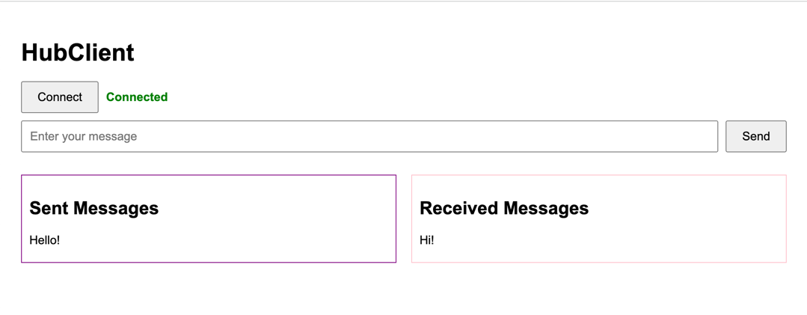

# Real-time Hub System

## Project Overview
The Real-time Hub System is designed to facilitate seamless real-time communication between multiple clients through a central hub architecture. The system comprises two primary components: the HubServer and the HubClient WebServer, both implemented in Golang. Additionally, the system leverages Redis for efficient message broadcasting and pub-sub capabilities.

## Prerequisites
* Docker
* Docker Compose
* Golang 1.22 or later

## Infrastructure
* Machine: Any machine with Docker and Docker Compose installed.

## Key Features
- **Real-time Communication**: Enables clients to communicate with each other in real-time via WebSocket connections.
- **Scalability**: Supports horizontal scaling by allowing multiple HubServer instances to handle increased load and ensure high availability.
- **Redis Integration**: Utilizes Redis for inter-hub communication ensuring efficient message broadcasting and pub-sub capabilities.

## System Architecture

### HubServer
The HubServer is responsible for managing WebSocket connections from clients, handling message broadcasting within the hub, and communicating with other HubServers via Redis.
1. **Websocket Management**:
   - Listens for WebSocket connection requests from clients. 
   - Manages active connections and ensures messages are broadcasted to all connected clients, except the sender.
2. **Intra-Hub Messaging**:
   - Receives messages from any connected client and broadcasts them to all other directly connected clients of the HubServer.
3. **Inter-Hub Messaging**:
   - Publishes messages to a Redis pub-sub channel to ensure they are broadcasted across all HubServer
   - Subscribes to the Redis pub-sub channel to receive messages from other HubServers and broadcasts them to its connected clients.
4. **Broadcast Storm Prevention**:
   - Implements checks to ensure messages are not redundantly broadcasted back to the origin HubServer or Redis, avoiding broadcast storms.

### HubClient WebServer
The HubClient WebServer is a simple web server that serves a simple HTML page for connecting to the HubServer via WebSocket. The client-side application is a basic chat interface that allows users to send and receive messages in real-time. There is a 1:1 mapping between the HubServer and the HubClient WebServer.

1. **Serve HTML Page**:
   - Hosts a static HTML page on the specified port..
   - The HTML page includes a WebSocket client that connects to the HubServer.
2. **User Interface**:
   - Provides a connect button to establish a WebSocket connection with the HubServer.
   - Allows users to send messages via an input field.
   - Displays received messages in real-time, with the most recent message appearing at the top.

### Redis Pub-Sub Integration
Redis is used to facilitate inter-hub communication by acting as a message broker for broadcasting messages across all HubServers. The HubServer publishes messages to a Redis pub-sub channel, which are then received by all other HubServers. This ensures that messages are broadcasted to all connected clients across different HubServers.

## Docker and Docker Compose
                +--------------------+
                |     Redis Pub-Sub  |
                |                    |
                +--------------------+
                          ^
                          |
                          |
                          v
            +-------------+-------------+
            ^                           ^
            |                           |
    +-------v-------+           +-------v-------+
    |   HubServer1  |           |   HubServer2  |
    |               |           |               |
    +---------------+           +---------------+
            ^                           ^
            |                           |
            |                           |
    +-------v-------+           +-------v-------+
    |   Client A    |           |   Client D    |
    +---------------+           +---------------+
    +---------------+           +---------------+
    |   Client B    |           |   Client E    |
    +---------------+           +---------------+
    +---------------+           +---------------+
    |   Client C    |           |   Client F    |
    +---------------+           +---------------+

The project includes out of the box Docker and Docker Compose configurations to simplify the setup and management of the system components. The Docker setup ensures that all services are containerized, providing an isolated and consistent environment for running the application.

### Components
1. **HubServer**: Two HubServer containers to handle WebSocket connections from clients and message broadcasting.
2. **HubClient WebServer**: Two HubClient containers(one for each HubServer) serving the HTML pages for realtime user interaction via chats.
3. **Redis**: A Redis container to facilitate inter-hub communication by acting as a message broker for broadcasting messages.

### Explanation:
   - **Redis Pub-Sub**: Acts as the central message broker, enabling communication between different HubServer instances. 
   - **HubServer1 & HubServer2**: These are instances of the HubServer component, managing WebSocket connections and broadcasting messages to their respective connected clients. 
   - **Clients (A, B, C, D, E, F)**: These represent individual clients connected to the HubServers via WebSocket. Clients can send messages to the HubServer, which then broadcasts the message to all other connected clients and publishes it to Redis for inter-hub communication.

### Bi-Directional Communication Flow:
1. A client (e.g., Client A) sends a message to HubServer1.
2. HubServer1 broadcasts the message to its connected clients (e.g., Client B, C).
3. HubServer1 also publishes the message to the Redis pub-sub channel.
4. Redis pub-sub distributes the message to all subscribed HubServers (e.g., HubServer2).
5. HubServer2 broadcasts the message to its connected clients (e.g., Client D, Client E and Client F).

This setup ensures real-time message distribution across multiple clients and HubServers, leveraging Redis for efficient pub-sub messaging.

### Running the System
To run the Real-time Hub System using Docker Compose, follow these steps:
1. Clone the repository to your local machine.
    ```shell
    git clone git@github.com:soumya-codes/realtime-hub.git
    cd realtime-hub
    ```
2. Download Go Dependencies:
    ```shell
    make go-deps
    ```

3. Bring up the setup.
    ```shell
    make setup
    ```
4. Access the HubClient WebServer interface in your browser.
    - Open three tabs on `http://localhost:9081` and click on the **Connect** button to establish a web-socket connection with Hub1.
    - Open three tabs on `http://localhost:9082` and click on the **Connect** button to establish a connection a web-socket connection with Hub2.

   **Note:** You can open multiple tabs to simulate multiple clients connecting to the HubServer. Make sure you establish the connection by clicking the connect button in each tabs before sending messages.

5. Send messages between clients and observe real-time message broadcasting across different clients and HubServers.

6. Bring down the setup.
    ```shell
    make teardown
    ```
## UI Screenshots
### HubClient WebServer Interface

